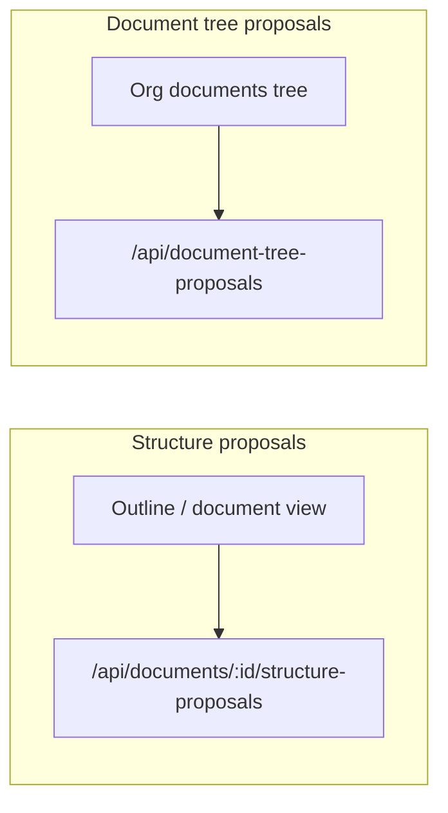

# Colabora Application Architecture

**Last Updated:** January 2025  
**Status:** Current System Architecture

---

## Overview

Colabora is a full-stack collaborative document editing application with democratic governance features. The application enables teams to collaboratively draft documents with a proposal/voting system, organizational management, and real-time collaboration.

## Technology Stack

- **Backend**: Node.js 18+, Express.js
- **Frontend**: React 18, TypeScript, Vite
- **Database**: PostgreSQL (required at runtime)
- **Real-time**: Socket.io (WebSocket)
- **UI Framework**: Radix UI components with Tailwind CSS
- **Deployment**: Fly.io with Docker
- **Architecture**: Monolithic application with RESTful API

## System Architecture

### High-Level Architecture

```
┌─────────────────────────────────────────────────────────┐
│                    Client (React)                       │
│  ┌──────────┐  ┌──────────┐  ┌──────────┐            │
│  │  Pages   │  │Components│  │  Hooks   │            │
│  └──────────┘  └──────────┘  └──────────┘            │
│         │              │              │                │
│         └──────────────┴──────────────┘                │
│                        │                                 │
│                   WebSocket ───────────────┐            │
│                        │                    │            │
└────────────────────────┼────────────────────┼──────────┘
                         │                    │
                    HTTP/REST            WebSocket
                         │                    │
┌────────────────────────┼────────────────────┼──────────┐
│                    Server (Express)                     │
│  ┌──────────┐  ┌──────────┐  ┌──────────┐            │
│  │  Routes  │  │Modules  │  │Middleware│            │
│  └──────────┘  └──────────┘  └──────────┘            │
│         │              │              │                │
│         └──────────────┴──────────────┘                │
│                        │                                 │
│                   DatabaseManager                       │
│                        │                                 │
└────────────────────────┼────────────────────────────────┘
                         │
                    ┌────▼────┐
                    │PostgreSQL│
                    └─────────┘
```

## Directory Structure

```
Colabora_App_Refactored/
├── client/                    # React frontend
│   ├── src/
│   │   ├── components/        # React components (100+ files)
│   │   │   ├── governance/    # Governance components
│   │   │   ├── document-tree/ # Document tree components
│   │   │   ├── layout/        # Layout components
│   │   │   ├── OrganizationManagement/  # Org management
│   │   │   └── ui/            # Reusable UI components
│   │   ├── hooks/             # Custom React hooks
│   │   │   ├── useAuth.ts     # Authentication
│   │   │   ├── useWebSocket.ts # WebSocket connection
│   │   │   ├── useDocuments.ts # Document management
│   │   │   └── ...
│   │   ├── pages/             # Page components
│   │   ├── types/             # TypeScript definitions
│   │   ├── lib/               # API client, utilities
│   │   └── main.tsx           # Entry point
│   ├── build/                 # Production build output
│   └── package.json
│
├── server/                    # Express backend
│   ├── routes/                # API route handlers (21 files)
│   │   ├── activity.js        # Activity feed routes
│   │   ├── admin.js           # Admin routes
│   │   ├── agreed-versions.js # Agreed document versions
│   │   ├── auth.js            # Authentication routes
│   │   ├── comments.js        # Comment routes
│   │   ├── decisions.js        # Unified decisions timeline
│   │   ├── debated-proposals.js # Debated proposals
│   │   ├── document-tree-proposals.js # Document tree proposals
│   │   ├── documents.js       # Document routes
│   │   ├── error-reports.js   # Error reporting
│   │   ├── export.js          # Document export
│   │   ├── governance.js      # Governance routes
│   │   ├── notifications.js   # Notification routes
│   │   ├── organizations.js   # Organization routes
│   │   ├── paragraphs.js      # Paragraph routes
│   │   ├── pending-votes.js   # Pending votes
│   │   ├── proposals.js       # Proposal routes
│   │   ├── search.js          # Search routes
│   │   ├── structure-history.js # Structure history
│   │   ├── structure-proposals.js # Structure proposals
│   │   └── votes.js           # Voting routes
│   ├── modules/               # Business logic modules (18 files)
│   │   ├── BaseLockManager.js # Base lock manager
│   │   ├── database.js        # Database utilities
│   │   ├── document-collaborator-sync.js # Collaborator sync
│   │   ├── document-status.js # Document status management
│   │   ├── emailService.js    # Email service
│   │   ├── export.js          # Export functionality
│   │   ├── health.js          # Health checks
│   │   ├── locks.js           # Lock management
│   │   ├── notifications.js   # Notification system
│   │   ├── permissions.js     # Permission management
│   │   ├── rule-validation.js # Governance rule validation
│   │   ├── safety-mechanisms.js # Safety mechanisms
│   │   ├── scheduler.js       # Background jobs
│   │   ├── search.js          # Search functionality
│   │   ├── server.js          # Server initialization
│   │   ├── unified-voting.js  # Unified voting system
│   │   ├── voting.js          # Voting logic
│   │   └── websocket.js       # WebSocket manager
│   ├── middleware/            # Express middleware
│   │   ├── auth.js            # Authentication middleware
│   │   ├── errorHandler.js    # Error handling
│   │   ├── validation.js      # Request validation
│   │   ├── logger.js          # Logging
│   │   └── monitoring.js      # Metrics collection
│   ├── database/              # Database management
│   │   ├── DatabaseManager.js # Database manager
│   │   ├── MigrationRunner.js # Migration runner
│   │   └── services/           # Database services
│   ├── migrations/            # Database migrations
│   ├── bootstrap.js           # Application bootstrap
│   ├── config.js              # Configuration
│   └── index.js               # Entry point
│
├── tests/                     # Test suite
│   ├── unit/                  # Unit tests
│   ├── integration/           # Integration tests
│   ├── e2e/                   # End-to-end tests
│   └── utils/                 # Test utilities
│
├── docs/                      # Documentation
│   ├── active/                # Active documentation
│   └── archive/               # Archived documentation
│
├── Dockerfile                 # Docker configuration
├── fly.toml                   # Fly.io configuration
└── package.json               # Root package.json
```

## Core Features

### 1. Document Management

- **Document Types**: Personal, Shared, Organizational
- **Hierarchical Structure**: Documents can have parent/child relationships
- **Document Status**: Draft, Voting, Agreed, Archived
- **Collaboration**: Multiple users can collaborate on documents
- **Version History**: Track changes and proposals

**Key Routes:**
- `GET /api/documents` - List documents
- `POST /api/documents` - Create document
- `GET /api/documents/:id` - Get document
- `PUT /api/documents/:id` - Update document
- `DELETE /api/documents/:id` - Delete document

### 2. Proposal & Voting System

- **Proposal Types**: Text changes, structure changes, deletion proposals
- **Voting**: PRO, NEUTRAL, CONTRA votes
- **Approval Threshold**: Configurable per document (default: 75%)
- **Voting Period**: Configurable proposal periods
- **Comments**: Threaded comments on proposals

**Key Routes:**
- `POST /api/documents/:id/paragraphs/:paragraphId/proposals` - Create proposal
- `POST /api/documents/:id/paragraphs/:paragraphId/proposals/:id/vote` - Vote on proposal
- `GET /api/documents/:id/votes` - Get votes
- `GET /api/documents/:id/voting-status` - Get voting status

#### Structure proposals vs document tree proposals

The application has two distinct "structure" proposal systems that are often confused:

- **Structure proposals (outline-level)** apply to a single document's outline (its paragraphs/sections). Route prefix: `/api/documents/:documentId/structure-proposals`. Operations: MOVE, MERGE, SPLIT, DELETE, RENAME_HEADING, CHANGE_HEADING_LEVEL, INSERT_NEW. Users trigger them from the **document view** / document outline (e.g. "Propose restructuring" in the editor); they also appear in the organization Dashboard and Representatives tabs for relevant documents.
- **Document tree proposals (hierarchy)** apply to the organization's document hierarchy (parent/child, ordering of documents and folders). Route prefix: `/api/document-tree-proposals` (e.g. `GET /api/document-tree-proposals/:documentId`, `POST /api/document-tree-proposals` with body, vote/complete by `:proposalId`). Operations: MOVE, DELETE, REORDER. Users trigger them from the **organization documents tree** (e.g. reordering or moving documents under folders in Organization > Documents).

Quick reference: Structure proposals are created from the document outline/structure view. Document tree proposals are created from the organization documents tree.

For more on structure proposals (outline), see [STRUCTURE_PROPOSALS.md](active/STRUCTURE_PROPOSALS.md).



### 3. Organizational Governance

- **Organizations**: Create and manage organizations
- **Governance Rules**: Configurable governance rules per organization
- **Elections**: Democratic elections for representatives
- **Rule Proposals**: Propose and vote on governance rule changes
- **Representatives**: Elected representatives with special permissions
- **Bootstrap Mode**: Initial setup mode for new organizations

**Key Routes:**
- `GET /api/governance/:organizationId/governance-rules` - Get rules
- `POST /api/governance/:organizationId/rule-proposals` - Propose rule change
- `POST /api/governance/:organizationId/elections` - Create election
- `POST /api/governance/:organizationId/elections/:id/vote` - Vote in election

### 4. Real-time Collaboration

- **WebSocket**: Socket.io for real-time updates
- **Events**: Document updates, proposal changes, vote updates, comments
- **Notifications**: Real-time notifications for relevant events

**WebSocket Events:**
- `document:update` - Document changed
- `proposal:created` - New proposal
- `vote:cast` - Vote cast
- `comment:created` - New comment

### 5. User Management

- **Authentication**: JWT-based authentication
- **Roles**: Admin, User
- **Profiles**: User profiles with avatars and bios
- **Organizations**: Users can belong to multiple organizations
- **Invitations**: Email-based invitations to organizations

**Key Routes:**
- `POST /api/auth/login` - Login
- `POST /api/auth/register` - Register
- `GET /api/auth/me` - Get current user

## Database Schema

The application requires **PostgreSQL** in all environments. `DATABASE_URL` must be set and must start with `postgres://` or `postgresql://` (validated during server startup).

### Core User & Organization Tables

#### `users`
User accounts and profiles.
- `id` (TEXT PRIMARY KEY) - Unique user identifier
- `name` (TEXT NOT NULL) - User display name
- `email` (TEXT UNIQUE NOT NULL) - User email address
- `password_hash` (TEXT) - Hashed password (bcrypt)
- `avatar` (TEXT) - Avatar URL
- `bio` (TEXT) - User biography
- `role` (TEXT DEFAULT 'user') - User role: 'admin' or 'user'
- `default_home_view` (TEXT DEFAULT 'activity') - Default home view preference
- `preferences` (TEXT DEFAULT '{}') - JSON user preferences
- `created_at`, `updated_at` (DATETIME) - Timestamps

#### `organizations`
Organizations with democratic governance.
- `id` (TEXT PRIMARY KEY) - Unique organization identifier
- `name` (TEXT NOT NULL) - Organization name
- `description` (TEXT) - Organization description
- `representatives` (TEXT NOT NULL) - JSON array of user IDs (legacy)
- `membership_policy` (TEXT) - 'open' or 'invitation'
- `voting_enabled` (BOOLEAN) - Whether voting is enabled
- `voting_threshold` (REAL DEFAULT 0.5) - Default voting threshold
- `is_active` (BOOLEAN) - Organization active status
- `created_by_admin_id` (TEXT NOT NULL) - Admin who created the organization
- `branding_color`, `branding_logo_url`, `branding_title`, `branding_banner_url` - Customization
- `icon_set`, `font_family` - Design customization
- `created_at` (DATETIME) - Creation timestamp

#### `organization_members`
Organization membership tracking.
- `id` (TEXT PRIMARY KEY)
- `organization_id` (TEXT NOT NULL) - Foreign key to organizations
- `user_id` (TEXT NOT NULL) - Foreign key to users
- `status` (TEXT) - 'active', 'legacy', or 'suspended'
- `invited_by_rep_id` (TEXT) - Representative who invited
- `joined_at`, `left_at` (DATETIME) - Membership timestamps
- UNIQUE(organization_id, user_id)

#### `organization_representatives`
Elected representatives for organizations.
- `id` (TEXT PRIMARY KEY)
- `organization_id` (TEXT NOT NULL) - Foreign key to organizations
- `user_id` (TEXT NOT NULL) - Foreign key to users
- `status` (TEXT) - 'active', 'inactive', or 'removed'
- `added_at`, `removed_at` (DATETIME) - Representative timestamps
- UNIQUE(organization_id, user_id)

#### `organization_governance_rules`
Governance rules per organization.
- `id` (TEXT PRIMARY KEY)
- `organization_id` (TEXT NOT NULL) - Foreign key to organizations
- `representative_term_months` (INTEGER DEFAULT 12) - Term length
- `representative_term_limits` (INTEGER) - Term limit
- `election_voting_method` (TEXT) - 'simple_majority', 'ranked_choice', or 'approval'
- `election_quorum_percentage` (REAL DEFAULT 0.5) - Quorum requirement
- `election_notice_days` (INTEGER DEFAULT 14) - Election notice period
- `default_voting_deadline_hours` (INTEGER DEFAULT 168) - Default voting deadline
- `default_quorum_percentage` (REAL DEFAULT 0.5) - Default quorum
- `document_proposal_period_days` (INTEGER DEFAULT 365) - Proposal period
- `threshold_calculation_method` (TEXT) - 'all_votes' or 'all_members'
- `default_acceptance_threshold` (REAL DEFAULT 75.0) - Default acceptance threshold
- `anonymous_voting_enabled`, `vote_change_allowed` (BOOLEAN) - Voting settings
- `default_structure_proposals_enabled` (BOOLEAN) - Structure proposals setting
- `representative_can_*` (BOOLEAN) - Representative permissions
- `tamper_proof_enabled`, `audit_trail_enabled` (BOOLEAN) - Security settings
- UNIQUE(organization_id)

#### `organization_invitations`
Email-based organization invitations.
- `id` (TEXT PRIMARY KEY)
- `organization_id` (TEXT NOT NULL) - Foreign key to organizations
- `email` (TEXT NOT NULL) - Invitee email
- `invitation_token` (TEXT UNIQUE NOT NULL) - Unique invitation token
- `invitation_type` (TEXT) - 'member' or 'representative'
- `invited_by` (TEXT NOT NULL) - Foreign key to users
- `status` (TEXT) - 'pending', 'accepted', 'expired', or 'cancelled'
- `expires_at` (DATETIME NOT NULL) - Expiration timestamp
- `accepted_at`, `accepted_by_user_id` (DATETIME, TEXT) - Acceptance tracking

### Document Management Tables

#### `documents`
Documents (personal, shared, or organizational).
- `id` (TEXT PRIMARY KEY) - Unique document identifier
- `title` (TEXT NOT NULL) - Document title
- `description` (TEXT) - Document description
- `owner_id` (TEXT NOT NULL) - Owner (user or organization)
- `collaborators` (TEXT) - JSON array of collaborator objects (legacy)
- `ownership_type` (TEXT) - 'personal', 'shared', or 'organizational'
- `creator_ids` (TEXT) - JSON array for shared docs
- `organization_id` (TEXT) - Foreign key to organizations (for organizational docs)
- `parent_id` (TEXT) - Foreign key to documents (hierarchical structure)
- `sort_order` (REAL) - Fractional ordering for tree positioning
- `status` (TEXT) - 'proposal', 'draft', 'agreed', 'voting', 'rejected', or 'expired'
- `proposal_deadline`, `voting_deadline`, `paragraph_proposals_cutoff` (DATETIME) - Deadlines
- `voting_started_at`, `adopted_at` (DATETIME) - Status timestamps
- `min_voters_required` (INTEGER DEFAULT 0) - Quorum requirement
- `deletion_proposed_at`, `deletion_proposed_by`, `deletion_vote_deadline` - Deletion tracking
- `acceptance_threshold` (REAL DEFAULT 75.0) - Approval threshold percentage
- `voting_anonymous`, `voting_anonymity_locked`, `vote_change_allowed` (BOOLEAN) - Voting settings
- `structure_proposals_enabled` (BOOLEAN) - Structure proposals setting
- `created_at`, `updated_at` (DATETIME) - Timestamps

#### `document_collaborators`
Document sharing and collaboration.
- `id` (TEXT PRIMARY KEY)
- `document_id` (TEXT NOT NULL) - Foreign key to documents
- `user_id` (TEXT NOT NULL) - Foreign key to users
- `created_at` (DATETIME) - Collaboration timestamp
- UNIQUE(document_id, user_id)

#### `paragraphs`
Document paragraphs/content.
- `id` (TEXT PRIMARY KEY)
- `document_id` (TEXT NOT NULL) - Foreign key to documents
- `title` (TEXT) - Paragraph title
- `heading_level` (TEXT) - Heading level (h1, h2, etc.)
- `text` (TEXT NOT NULL) - Paragraph content
- `order_index` (INTEGER NOT NULL) - Display order
- `created_at`, `updated_at` (DATETIME) - Timestamps

#### `proposals`
Proposed changes to paragraphs.
- `id` (TEXT PRIMARY KEY)
- `paragraph_id` (TEXT NOT NULL) - Foreign key to paragraphs
- `user_id` (TEXT NOT NULL) - Foreign key to users (proposer)
- `text` (TEXT NOT NULL) - Proposed text
- `type` (TEXT) - 'BODY' or 'TITLE'
- `heading_level` (TEXT) - Proposed heading level
- `approved` (BOOLEAN DEFAULT FALSE) - Approval status
- `invalidated` (BOOLEAN DEFAULT FALSE) - Invalidation status
- `created_at`, `updated_at` (DATETIME) - Timestamps

#### `votes`
Votes on proposals.
- `id` (TEXT PRIMARY KEY)
- `proposal_id` (TEXT NOT NULL) - Foreign key to proposals
- `user_id` (TEXT NOT NULL) - Foreign key to users (voter)
- `vote` (TEXT) - 'PRO', 'NEUTRAL', or 'CONTRA'
- `created_at` (DATETIME) - Vote timestamp
- UNIQUE(proposal_id, user_id)

#### `document_votes`
Document-level votes.
- `id` (TEXT PRIMARY KEY)
- `document_id` (TEXT NOT NULL) - Foreign key to documents
- `user_id` (TEXT NOT NULL) - Foreign key to users
- `vote` (TEXT) - 'PRO', 'NEUTRAL', or 'CONTRA'
- `created_at`, `updated_at` (DATETIME) - Timestamps
- UNIQUE(document_id, user_id)

#### `document_deletion_votes`
Votes on document deletion proposals.
- `id` (TEXT PRIMARY KEY)
- `document_id` (TEXT NOT NULL) - Foreign key to documents
- `user_id` (TEXT NOT NULL) - Foreign key to users
- `vote` (TEXT) - 'PRO', 'NEUTRAL', or 'CONTRA'
- `created_at` (DATETIME) - Vote timestamp
- UNIQUE(document_id, user_id)

#### `document_status_history`
History of document status changes.
- `id` (TEXT PRIMARY KEY)
- `document_id` (TEXT NOT NULL) - Foreign key to documents
- `old_status`, `new_status` (TEXT) - Status transition
- `changed_by` (TEXT) - Foreign key to users
- `change_reason` (TEXT) - Reason for change
- `created_at` (DATETIME) - Change timestamp

### Structure & Tree Management Tables

#### `structure_proposals`
Proposals for document structure changes.
- `id` (TEXT PRIMARY KEY)
- `document_id` (TEXT NOT NULL) - Foreign key to documents
- `user_id` (TEXT NOT NULL) - Foreign key to users
- `title` (TEXT NOT NULL) - Proposal title
- `description` (TEXT) - Proposal description
- `status` (TEXT) - 'draft', 'proposed', 'approved', or 'rejected'
- `approved`, `applied` (BOOLEAN) - Status flags
- `changes` (TEXT) - JSON array of structure changes (deprecated)
- `voting_deadline` (DATETIME) - Voting deadline
- `acceptance_threshold` (REAL DEFAULT 75.0) - Approval threshold
- `created_at`, `updated_at` (DATETIME) - Timestamps

#### `structure_proposal_votes`
Votes on structure proposals.
- `id` (TEXT PRIMARY KEY)
- `structure_proposal_id` (TEXT NOT NULL) - Foreign key to structure_proposals
- `user_id` (TEXT NOT NULL) - Foreign key to users
- `vote` (TEXT) - 'PRO', 'CONTRA', or 'NEUTRAL'
- `created_at`, `updated_at` (DATETIME) - Timestamps
- UNIQUE(structure_proposal_id, user_id)

#### `structure_operations`
Individual operations within structure proposals.
- `id` (TEXT PRIMARY KEY)
- `structure_proposal_id` (TEXT NOT NULL) - Foreign key to structure_proposals
- `operation_type` (TEXT NOT NULL) - 'MOVE', 'MERGE', 'SPLIT', 'DELETE', 'RENAME_HEADING', 'CHANGE_HEADING_LEVEL', or 'INSERT_NEW'
- `source_paragraph_ids` (TEXT) - Source paragraph IDs
- `target_paragraph_id` (TEXT) - Target paragraph ID
- `new_position_index` (INTEGER) - New position
- `new_parent_id` (TEXT) - New parent document
- `new_text` (TEXT) - New text content
- `new_heading_level` (TEXT) - New heading level
- `operation_data` (TEXT) - Additional operation data (JSON)
- `created_at` (DATETIME) - Operation timestamp

#### `structure_proposal_comments`
Comments on structure proposals.
- `id` (TEXT PRIMARY KEY)
- `structure_proposal_id` (TEXT NOT NULL) - Foreign key to structure_proposals
- `user_id` (TEXT NOT NULL) - Foreign key to users
- `text` (TEXT NOT NULL) - Comment text
- `parent_id` (TEXT) - Foreign key to structure_proposal_comments (threading)
- `created_at`, `updated_at` (DATETIME) - Timestamps

#### `document_tree_proposals`
Proposals for document tree changes (move, delete, reorder).
- `id` (TEXT PRIMARY KEY)
- `document_id` (TEXT NOT NULL) - Foreign key to documents
- `organization_id` (TEXT NOT NULL) - Foreign key to organizations
- `proposed_by_user_id` (TEXT NOT NULL) - Foreign key to users
- `operation_type` (TEXT NOT NULL) - 'MOVE', 'DELETE', or 'REORDER'
- `target_parent_id` (TEXT) - Target parent document
- `new_order` (INTEGER) - New order position
- `reason` (TEXT) - Proposal reason
- `status` (TEXT) - 'pending', 'approved', 'rejected', or 'applied'
- `created_at`, `updated_at` (DATETIME) - Timestamps

#### `document_tree_proposal_votes`
Votes on document tree proposals.
- `id` (TEXT PRIMARY KEY)
- `proposal_id` (TEXT NOT NULL) - Foreign key to document_tree_proposals
- `user_id` (TEXT NOT NULL) - Foreign key to users
- `vote` (TEXT NOT NULL) - 'PRO', 'NEUTRAL', or 'CONTRA'
- `created_at`, `updated_at` (DATETIME) - Timestamps
- UNIQUE(proposal_id, user_id)

### Comments & History Tables

#### `comments`
Threaded comments on proposals.
- `id` (TEXT PRIMARY KEY)
- `proposal_id` (TEXT NOT NULL) - Foreign key to proposals
- `user_id` (TEXT NOT NULL) - Foreign key to users
- `text` (TEXT NOT NULL) - Comment text
- `parent_id` (TEXT) - Foreign key to comments (threading)
- `created_at`, `updated_at` (DATETIME) - Timestamps

#### `history`
History of approved paragraph changes.
- `id` (TEXT PRIMARY KEY)
- `paragraph_id` (TEXT NOT NULL) - Foreign key to paragraphs
- `proposal_id` (TEXT NOT NULL) - Foreign key to proposals
- `user_id` (TEXT NOT NULL) - Foreign key to users
- `old_text` (TEXT) - Previous text
- `new_text` (TEXT NOT NULL) - New text
- `approval_percentage` (REAL NOT NULL) - Approval percentage
- `heading_level` (TEXT) - Heading level
- `created_at` (DATETIME) - Change timestamp
- `accepted_at` (DATETIME) - Acceptance timestamp

### Governance & Elections Tables

#### `representative_elections`
Elections for organization representatives.
- `id` (TEXT PRIMARY KEY)
- `organization_id` (TEXT NOT NULL) - Foreign key to organizations
- `election_title` (TEXT NOT NULL) - Election title
- `election_description` (TEXT) - Election description
- `status` (TEXT) - 'draft', 'nomination', 'voting', 'completed', or 'cancelled'
- `positions_available` (INTEGER NOT NULL) - Number of positions
- `term_start_date`, `term_end_date` (DATETIME) - Term dates
- `nomination_starts_at`, `nomination_ends_at` (DATETIME) - Nomination period
- `voting_starts_at`, `voting_ends_at` (DATETIME) - Voting period
- `quorum_required` (INTEGER) - Quorum requirement
- `anonymous_voting` (BOOLEAN DEFAULT 1) - Anonymous voting setting
- `total_voters`, `votes_cast` (INTEGER) - Voting statistics
- `quorum_met` (BOOLEAN) - Quorum status
- `election_completed_at` (DATETIME) - Completion timestamp
- `created_by` (TEXT NOT NULL) - Foreign key to users
- `trigger_type` (TEXT) - 'manual', 'resignation', 'term_expiration', or 'auto_scheduled'
- `triggered_by_term_id` (TEXT) - Related term ID
- `auto_advance_phases`, `phase_transition_in_progress` (BOOLEAN) - Phase management
- `created_at`, `updated_at` (DATETIME) - Timestamps

#### `election_candidates`
Candidates in elections.
- `id` (TEXT PRIMARY KEY)
- `election_id` (TEXT NOT NULL) - Foreign key to representative_elections
- `user_id` (TEXT NOT NULL) - Foreign key to users
- `candidate_statement` (TEXT) - Candidate statement
- `accepted_nomination` (BOOLEAN DEFAULT 0) - Nomination acceptance
- `nominated_by` (TEXT) - Foreign key to users (nominator)
- `nomination_accepted_at` (DATETIME) - Acceptance timestamp
- `votes_received` (INTEGER DEFAULT 0) - Vote count
- `elected` (BOOLEAN DEFAULT 0) - Election result
- `elected_position` (INTEGER) - Position number
- `created_at`, `updated_at` (DATETIME) - Timestamps

#### `election_votes`
Votes in elections.
- `id` (TEXT PRIMARY KEY)
- `election_id` (TEXT NOT NULL) - Foreign key to representative_elections
- `candidate_id` (TEXT) - Foreign key to election_candidates
- `user_id` (TEXT NOT NULL) - Foreign key to users
- `anonymous_token` (TEXT) - Anonymous voting token
- `vote_rank` (INTEGER) - Ranking (for ranked choice)
- `created_at` (DATETIME) - Vote timestamp
- UNIQUE(election_id, user_id, candidate_id)

#### `representative_terms`
Terms of service for representatives.
- `id` (TEXT PRIMARY KEY)
- `organization_id` (TEXT NOT NULL) - Foreign key to organizations
- `user_id` (TEXT NOT NULL) - Foreign key to users
- `term_number` (INTEGER NOT NULL) - Term sequence number
- `elected_in_election_id` (TEXT) - Foreign key to representative_elections
- `term_start_date`, `term_end_date` (DATETIME NOT NULL) - Term dates
- `term_status` (TEXT) - 'active', 'completed', 'removed', or 'resigned'
- `removed_by` (TEXT) - Foreign key to users
- `removed_at` (DATETIME) - Removal timestamp
- `removal_reason` (TEXT) - Reason for removal
- `resigned_at` (DATETIME) - Resignation timestamp
- `resignation_pending` (BOOLEAN DEFAULT 0) - Resignation status
- `replacement_election_id` (TEXT) - Replacement election
- `resignation_requested_at` (DATETIME) - Resignation request timestamp
- `failed_election_attempts` (INTEGER DEFAULT 0) - Failed election count
- `created_at`, `updated_at` (DATETIME) - Timestamps
- UNIQUE(organization_id, user_id, term_number)

### Voting & Policy Tables

#### `voting_sessions`
Voting sessions for various purposes.
- `id` (TEXT PRIMARY KEY)
- `organization_id` (TEXT NOT NULL) - Foreign key to organizations
- `session_type` (TEXT) - 'election', 'policy', 'document', 'membership', 'dissolution', or 'other'
- `related_entity_id` (TEXT) - Related entity ID
- `title` (TEXT NOT NULL) - Session title
- `description` (TEXT) - Session description
- `status` (TEXT) - 'draft', 'pending_approval', 'announced', 'active', 'completed', 'cancelled', or 'failed'
- `anonymous_voting` (BOOLEAN DEFAULT 1) - Anonymous voting setting
- `deadline_hours` (INTEGER DEFAULT 168) - Deadline in hours
- `quorum_percentage` (REAL DEFAULT 0.5) - Quorum requirement
- `required_majority` (REAL DEFAULT 0.5) - Required majority
- `voting_starts_at`, `voting_ends_at` (DATETIME) - Voting period
- `announced_at`, `completed_at` (DATETIME) - Status timestamps
- `eligible_voters_count`, `votes_cast_count` (INTEGER) - Voting statistics
- `quorum_met` (BOOLEAN) - Quorum status
- `yes_votes`, `no_votes`, `abstain_votes` (INTEGER) - Vote counts
- `result` (TEXT) - 'pending', 'approved', 'rejected', 'tied', 'quorum_not_met', or 'cancelled'
- `created_by` (TEXT NOT NULL) - Foreign key to users
- `created_at`, `updated_at` (DATETIME) - Timestamps

#### `voting_session_votes`
Votes in voting sessions.
- `id` (TEXT PRIMARY KEY)
- `voting_session_id` (TEXT NOT NULL) - Foreign key to voting_sessions
- `user_id` (TEXT) - Foreign key to users (null if anonymous)
- `anonymous_token` (TEXT) - Anonymous voting token
- `vote` (TEXT) - 'yes', 'no', or 'abstain'
- `created_at` (DATETIME) - Vote timestamp
- UNIQUE(voting_session_id, anonymous_token)

#### `anonymous_vote_ballots`
Anonymous vote ballots for tamper-proof voting.
- `id` (TEXT PRIMARY KEY)
- `voting_session_id` (TEXT NOT NULL) - Foreign key to voting_sessions
- `voter_token` (TEXT NOT NULL) - Voter token
- `vote_choice` (TEXT) - 'yes', 'no', or 'abstain'
- `vote_weight` (INTEGER DEFAULT 1) - Vote weight
- `voted_at` (DATETIME) - Vote timestamp
- `vote_hash` (TEXT) - Vote hash for verification
- `ip_address`, `user_agent_hash` (TEXT) - Security tracking
- UNIQUE(voting_session_id, voter_token)

#### `voter_tokens`
Tokens for anonymous voting.
- `id` (TEXT PRIMARY KEY)
- `voting_session_id` (TEXT NOT NULL) - Foreign key to voting_sessions
- `user_id` (TEXT NOT NULL) - Foreign key to users
- `anonymous_token` (TEXT NOT NULL) - Anonymous token
- `token_issued_at` (DATETIME) - Token issuance timestamp
- `token_used` (BOOLEAN DEFAULT 0) - Token usage status
- `token_used_at` (DATETIME) - Token usage timestamp
- UNIQUE(voting_session_id, user_id)
- UNIQUE(voting_session_id, anonymous_token)

#### `policy_votes`
Policy votes for organizations.
- `id` (TEXT PRIMARY KEY)
- `organization_id` (TEXT NOT NULL) - Foreign key to organizations
- `title` (TEXT NOT NULL) - Policy title
- `description` (TEXT) - Policy description
- `document_id` (TEXT) - Foreign key to documents (related document)
- `status` (TEXT) - 'draft', 'active', 'completed', or 'cancelled'
- `threshold_percentage` (REAL DEFAULT 50.0) - Approval threshold
- `deadline_at` (DATETIME) - Voting deadline
- `anonymous_voting` (BOOLEAN DEFAULT 0) - Anonymous voting setting
- `votes_yes`, `votes_no`, `votes_abstain` (INTEGER) - Vote counts
- `created_by` (TEXT NOT NULL) - Foreign key to users
- `created_at`, `updated_at` (DATETIME) - Timestamps

#### `policy_vote_responses`
Responses to policy votes.
- `id` (TEXT PRIMARY KEY)
- `policy_vote_id` (TEXT NOT NULL) - Foreign key to policy_votes
- `user_id` (TEXT NOT NULL) - Foreign key to users
- `vote` (TEXT) - 'yes', 'no', or 'abstain'
- `voted_at` (DATETIME) - Vote timestamp
- UNIQUE(policy_vote_id, user_id)

### Governance Rule Proposals Tables

#### `governance_rule_proposals`
Proposals to change governance rules.
- `id` (TEXT PRIMARY KEY)
- `organization_id` (TEXT NOT NULL) - Foreign key to organizations
- `title` (TEXT NOT NULL) - Proposal title
- `description` (TEXT) - Proposal description
- `current_rule_field` (TEXT NOT NULL) - Field being changed
- `current_rule_value` (TEXT) - Current value
- `proposed_rule_value` (TEXT NOT NULL) - Proposed value
- `status` (TEXT) - 'draft', 'active', 'approved', 'rejected', or 'cancelled'
- `voting_starts_at`, `voting_ends_at` (DATETIME) - Voting period
- `threshold_percentage` (REAL DEFAULT 75.0) - Approval threshold
- `anonymous_voting` (BOOLEAN DEFAULT 1) - Anonymous voting setting
- `votes_yes`, `votes_no`, `votes_abstain` (INTEGER) - Vote counts
- `total_voters`, `votes_cast` (INTEGER) - Voting statistics
- `created_by` (TEXT NOT NULL) - Foreign key to users
- `approved_at`, `implemented_at` (DATETIME) - Status timestamps
- `created_at`, `updated_at` (DATETIME) - Timestamps

#### `governance_rule_proposal_options`
Options for multi-option rule proposals.
- `id` (TEXT PRIMARY KEY)
- `proposal_id` (TEXT NOT NULL) - Foreign key to governance_rule_proposals
- `option_title` (TEXT NOT NULL) - Option title
- `option_description` (TEXT) - Option description
- `proposed_value` (TEXT NOT NULL) - Proposed value
- `created_at` (DATETIME) - Creation timestamp

#### `governance_rule_proposal_votes`
Votes on governance rule proposals.
- `id` (TEXT PRIMARY KEY)
- `proposal_id` (TEXT NOT NULL) - Foreign key to governance_rule_proposals
- `user_id` (TEXT NOT NULL) - Foreign key to users
- `selected_option_id` (TEXT) - Foreign key to governance_rule_proposal_options
- `vote` (TEXT) - 'PRO', 'NEUTRAL', or 'CONTRA'
- `voted_at` (DATETIME) - Vote timestamp
- UNIQUE(proposal_id, user_id)

### Audit & Analytics Tables

#### `organization_audit`
Audit trail for organization actions.
- `id` (TEXT PRIMARY KEY)
- `organization_id` (TEXT NOT NULL) - Foreign key to organizations
- `action_type` (TEXT) - Action type (see code for full list)
- `performed_by_user_id` (TEXT NOT NULL) - Foreign key to users
- `affected_user_id` (TEXT) - Foreign key to users (if applicable)
- `details` (TEXT) - Action details (JSON)
- `ip_address`, `user_agent` (TEXT) - Security tracking
- `created_at` (DATETIME) - Action timestamp

#### `voting_analytics`
Voting analytics and statistics.
- `id` (TEXT PRIMARY KEY)
- `organization_id` (TEXT NOT NULL) - Foreign key to organizations
- `period_start`, `period_end` (TEXT NOT NULL) - Period dates
- `total_members`, `active_voters` (INTEGER) - Membership statistics
- `total_votes_cast` (INTEGER) - Vote count
- `average_votes_per_member` (REAL) - Average votes
- `elections_held` (INTEGER) - Election count
- `average_election_turnout` (REAL) - Turnout statistics
- `quorum_achieved_percentage` (REAL) - Quorum statistics
- `total_decisions_made`, `decisions_passed`, `decisions_failed` (INTEGER) - Decision statistics
- `average_decision_time_hours` (REAL) - Decision timing
- `created_at`, `updated_at` (DATETIME) - Timestamps

### System Tables

#### `migration_history`
Database migration tracking.
- `id` (TEXT PRIMARY KEY)
- `migration_name` (TEXT UNIQUE NOT NULL) - Migration name
- `executed_at` (DATETIME) - Execution timestamp
- `execution_time_ms` (INTEGER) - Execution time
- `success` (BOOLEAN DEFAULT 1) - Success status
- `error_message` (TEXT) - Error message (if failed)

### Additional Tables (Created via Migrations)

The following tables are created via migration scripts in `server/migrations/`:
- `error_reports` - Error reporting system
- `notifications` - User notifications
- `notification_preferences` - Notification preferences
- `notification_digest_queue` - Notification digest queue
- `governance_rule_history` - History of governance rule changes

### Migration System

- **Automatic migrations** on startup via `DatabaseManager`
- **Migration files** in `server/migrations/` (29 migration files)
- **Version tracking** in `migration_history` table
- **PostgreSQL runtime** - Startup fails fast if `DATABASE_URL` is missing/invalid
- **Rollback support** - Manual rollback via migration scripts

## API Design

### Authentication

All API endpoints (except auth endpoints) require authentication via JWT token in the `Authorization` header:

```
Authorization: Bearer <token>
```

### Response Format

Standard JSON responses:

**Success:**
```json
{
  "success": true,
  "data": { ... }
}
```

**Error:**
```json
{
  "error": "Error message",
  "code": "ERROR_CODE",
  "details": { ... }
}
```

### Status Codes

- `200` - Success
- `201` - Created
- `400` - Bad Request
- `401` - Unauthorized
- `403` - Forbidden
- `404` - Not Found
- `429` - Too Many Requests
- `500` - Internal Server Error
- `503` - Service Unavailable

## Security

### Authentication & Authorization

- JWT tokens with configurable expiration
- Role-based access control (admin/user)
- Document-level access control
- Organization-level permissions

### Security Headers

- Helmet.js for security headers
- CORS configuration
- Rate limiting (separate limits for auth and API)
- XSS protection
- Content Security Policy (production)

### Rate Limiting

- Auth endpoints: 10 requests per 15 minutes (production)
- API endpoints: 100 requests per 15 minutes (production)
- Configurable via environment variables

## Deployment

### Fly.io Configuration

- **Region**: Frankfurt (fra)
- **Memory**: 2GB
- **CPU**: 1 shared CPU
- **Volume**: 3GB persistent volume (if running colocated services; app DB runtime is PostgreSQL)
- **Health Checks**: `/api/health/ready` every 30s

### Docker

Multi-stage Docker build:
1. Builder stage: Install dependencies and build frontend
2. Production stage: Minimal image with only runtime dependencies

### Environment Variables

See `README.md` for required and optional environment variables.

## Monitoring & Logging

### Logging

- Winston logger with configurable levels
- Structured logging with context
- Separate loggers for security events
- Log rotation and file management

### Health Checks

- `/api/health/ready` - Readiness check (for Fly.io)
- `/api/health/live` - Liveness check
- `/api/health/detailed` - Detailed health information

### Metrics

- Request metrics collection
- Security event tracking
- Performance monitoring

## Testing

Comprehensive test suite covering:
- Unit tests for individual functions
- Integration tests for API endpoints
- End-to-end workflow tests
- WebSocket real-time tests

## Meeting Protocol Contract

- Core meeting API is exposed under `/api/organizations/:organizationId/meetings` with minutes sub-routes under `/api/organizations/:organizationId/meetings/:meetingId`.
- Moderator authority is centralized in `MeetingService.canModerateMeeting` (creator, active representative, or invited meeting moderator).
- Minutes finalization lifecycle:
  - finalization updates `meetings.minutes_finalized_at`
  - minutes document transitions `draft -> agreed` when applicable
  - unfinalization transitions `agreed -> draft` when applicable
- Meeting websocket channel (`meeting-<meetingId>`) emits protocol events such as `minutes-event-added`, `vote-*`, `agenda-*`, `todo-*`, `moderator-*`, `minutes-finalized`, and `minutes-timeline-reordered`.
- Client treats websocket payloads as incremental updates with refetch fallback when payloads are partial.
- Database migration tests

See `README.md` for test commands.

## Development Workflow

1. **Local Development**: `npm run dev` and `npm run dev:frontend`
2. **Testing**: `npm test` or specific test suites
3. **Build**: `npm run build`
4. **Deploy**: `fly deploy` (after setting secrets)

## Future Considerations

- PgBouncer/managed PostgreSQL tuning for larger deployments
- Redis for caching and session storage
- File upload support for document attachments
- Advanced search with full-text indexing
- API rate limiting per user/organization
- Audit logging for compliance

---

For detailed API documentation, see individual route files in `server/routes/`.
